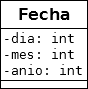

##  FORMULARIO FECHA

 Descargue la carpeta Practico5_Fecha, descomprimala y dejela en su carpeta Workspace de eclipse (recuerde que tiene que importar desde eclipse la carpeta que le queda adentro con el mismo nombre)

 Codificar el FrmFecha que se encuentra en el paquete grafica para poder cargar los atributos de una fecha (dia, mes, anio) en campos de texto y en un 4to campo de texto visualizar la fecha utilizando el método toString.

 Recuerde que a la clase Fecha del paquete logica le corresponde el siguiente Diagrama de clases:

 

 Una vez resuelto el ejercicio, borre la carpeta Practico5_Fecha (la que está aquí) y suba su proyecto (el que tiene en Workspace de eclipse)
