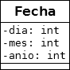
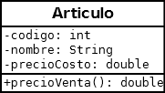

# Practico6
## Ejercicio1 - FORMULARIO FECHA

Realice un proyecto llamado **Ejer1_Fecha**, con dos paquetes, *logica* y *grafica*.
En el paquete **logica** cree una class llamada *Fecha*, aquí dejo su código.

En el paquete **grafica** cree un JFrame llamado *FrmFecha* para poder cargar los atributos de una fecha (dia, mes, anio) en 3 campos de texto y en un 4to campo de texto visualizar la fecha utilizando el método toString.

Recuerde que a la clase Fecha del paquete logica le corresponde el siguiente Diagrama de clases:

 

## Ejercicio2 - FORMULARIO ARTICULO
Realice un proyecto llamado **Ejer2_Articulo**, con dos paquetes, *logica* y *grafica*.
En el paquete **logica** cree una class llamada *Articulo*, aquí dejo su código.

En el paquete **grafica** cree un JFrame llamado *FrmArticulo* para poder cargar los atributos de un articulo en 3 campos de texto y en un 4to campo de texto visualizar el articulo utilizando el método toString.
 Codificar el FrmArticulo que se encuentra en el paquete grafica para poder cargar los atributos de un Articulo (codigo, nombre, precioCosto) en campos de texto y en un 4to campo de texto visualizar el precio de Venta utilizando el método precioVenta.
 
 Recuerde que a la clase Articulo del paquete logica le corresponde el siguiente Diagrama de clases:

 

## Ejercicio3 - FORMULARIO EMPLEADO
Realice un proyecto llamado **Ejer3_Empleado**, con dos paquetes, *logica* y *grafica*.
En el paquete **logica** cree una class llamada *Empleado*, aquí dejo su código.

En el paquete **grafica** cree un JFrame llamado *FrmEmpleado* para poder cargar los atributos de un empleado
 Codificar el FrmEmpleado que se encuentra en el paquete grafica para poder cargar los atributos de un Empleado (codigo, nombre, precioCosto) en campos de texto y en un 4to campo de texto visualizar el precio de Venta utilizando el método precioVenta.
 
 Recuerde que a la clase Empleado del paquete logica le corresponde el siguiente Diagrama de clases:
  
Recordar que los métodos: 

• ** public double sueldoAnual()** : El método devuelve el salario anual percibido.

• ** public void presentismo()**: Incrementa el valor de salario en un 10%.

• ** public String toString()** : Devuelve atributos y salarioAnual().
Debe tener dos botones (además de Limpiar y Salir):
1) Botón "Salario Anual" que al presionarlo despliegue en otro campo de texto el salario anual. 
2) Botón "Presentismo" que al presionarlo modifique el campo de texto del salario anual, habiendole sumado el presentismo correspondiente.
